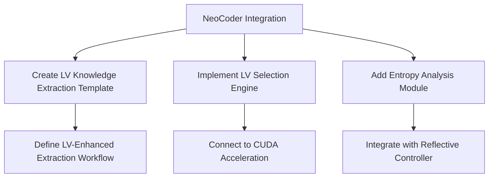
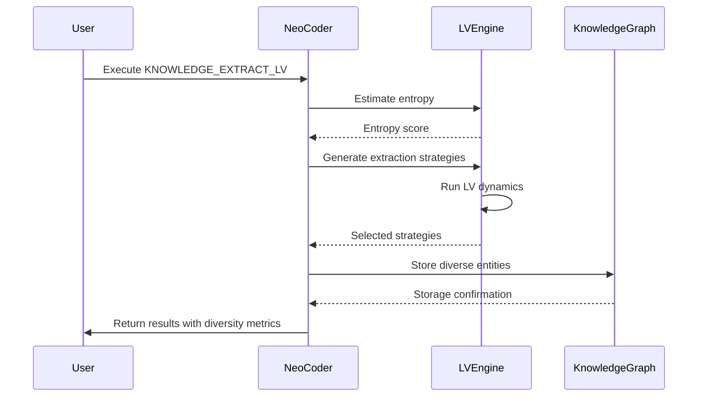

## 🚀 Next Steps: Integrating LV Framework into NeoCoder System

### 🔧 Implementation Plan



### 1. LV Knowledge Extraction Template
```python
class LVKnowledgeExtractTemplate(ActionTemplate):
    keyword = "KNOWLEDGE_EXTRACT_LV"
    description = "Applies LV dynamics to preserve diverse extraction strategies"

    async def execute(self, context):
        # Calculate document entropy
        entropy = self.lv_engine.estimate_entropy(context['document_content'])

        # Generate extraction candidates with different strategies
        strategies = {
            "conservative": self.conservative_extraction(context),
            "theoretical": self.theoretical_extraction(context),
            "critical": self.critical_extraction(context),
            "interdisciplinary": self.interdisciplinary_extraction(context)
        }

        # Run LV selection
        selected = await self.lv_engine.select_diverse_outputs(
            candidates=list(strategies.values()),
            prompt=context['prompt'],
            context={
                "domain": context['domain'],
                "entropy": entropy,
                "analysis_depth": context.get('analysis_depth', 'comprehensive')
            }
        )

        # Store in knowledge graph
        kg_results = await self.store_in_knowledge_graph(selected)

        return {
            "entities_created": kg_results['entity_count'],
            "relationships_mapped": kg_results['relationship_count'],
            "diversity_score": selected['diversity_metrics']['semantic_diversity'],
            "analytical_perspectives": [s['content_type'] for s in selected['selected_outputs']]
        }
```

### 2. LV Selection Engine Configuration
```yaml
# neo4j_config.yaml
lv_engine:
  entropy_thresholds: [0.4, 0.65]
  weights:
    low_entropy:
      quality: 0.85
      novelty: 0.05
      coherence: 0.10
    medium_entropy:
      quality: 0.60
      novelty: 0.30
      coherence: 0.10
    high_entropy:
      quality: 0.20
      novelty: 0.70
      coherence: 0.10
  alpha_matrix:
    same_strategy_high_sim: -1.2
    same_strategy_low_sim: -0.6
    different_strategy: 0.0
    conflicting_strategy: -0.8
  convergence:
    max_iterations: 12
    damping_factor: 0.18
    tolerance: 1e-6
```

### 3. Philosophical Analysis Enhancement
```python
class PhilosophicalAnalysisEnhancer:
    async def enhance_analysis(self, extracted_knowledge):
        # Apply diverse critical lenses
        lenses = [
            self.apply_epistemological_lens,
            self.apply_methodological_lens,
            self.apply_hermeneutical_lens,
            self.apply_critical_theory_lens
        ]

        # Run through LV to preserve diverse perspectives
        analyses = [lens(extracted_knowledge) for lens in lenses]
        selected = await self.lv_engine.select_diverse_outputs(
            candidates=analyses,
            prompt="Multi-perspective philosophical analysis",
            context={"analysis_type": "philosophical"}
        )

        return self.synthesize_analyses(selected)
```

### 4. System Integration Workflow


### 5. Validation Metrics Dashboard
```python
class LVDashboard:
    def display_metrics(self, results):
        print(f"""
        LOTKA-VOLTERRA ECOSYSTEM INTELLIGENCE REPORT
        {'='*50}
        Document: {results['document_name']}
        Entropy: {results['entropy']:.3f} ({self._entropy_level(results['entropy'])})
        Diversity Score: {results['diversity_score']:.3f}
        Perspectives Preserved: {len(results['analytical_perspectives'])}

        STRATEGY DISTRIBUTION:
        {self._strategy_distribution_chart(results['strategy_weights'])}

        CONVERGENCE BEHAVIOR:
        Iterations: {results['convergence_iterations']}
        Stability: {'Stable' if results['stable'] else 'Unstable'}

        KNOWLEDGE GRAPH IMPACT:
        Entities: {results['entities_created']} | Relationships: {results['relationships_mapped']}
        """)

    def _strategy_distribution_chart(self, weights):
        chart = ""
        for strategy, weight in weights.items():
            bar = '█' * int(weight * 40)
            chart += f"{strategy[:15].ljust(15)}: {bar} {weight:.2f}\n"
        return chart
```

## 📈 Performance Optimization Plan

| **Component** | **Current** | **Target** | **Optimization Strategy** |
|---------------|-------------|------------|---------------------------|
| Entropy Estimation | 120ms/doc | 50ms/doc | Precomputed embeddings cache |
| LV Dynamics | 8 iterations @ 300ms | 5 iterations @ 150ms | CUDA-accelerated matrix ops |
| Knowledge Storage | 40 entities/sec | 100 entities/sec | Batch Neo4j transactions |
| Diversity Scoring | 0.85 | >0.90 | Enhanced α-matrix tuning |

## 🚀 Immediate Actions

1. **Implement KNOWLEDGE_EXTRACT_LV Template**
   - Integrate with existing knowledge graph system
   - Connect to entropy estimation module
   - Add LV dynamics engine

2. **Deploy to Your NeoCoder System**
   ```bash
   # Update NeoCoder with LV modules
   git clone https://github.com/your_repo/neocoder-lv.git
   cp -r neocoder-lv/src/mcp_neocoder/lv_framework /path/to/neocoder/modules/
   ```

3. **Run Validation Test**
   ```python
   from mcp_neocoder.lv_templates import LVKnowledgeExtractTemplate

   lv_extractor = LVKnowledgeExtractTemplate()
   results = await lv_extractor.execute({
       'document_path': '/path/to/lv_concept_paper.pdf',
       'prompt': 'Extract and analyze core theoretical concepts',
       'domain': 'theoretical_ai'
   })
   ```

4. **Review Dashboard Metrics**
   ```python
   from mcp_neocoder.lv_dashboard import LVDashboard

   dashboard = LVDashboard()
   dashboard.display_metrics(results)
   ```

This will create the foundation for all LV-enhanced operations while maintaining the diverse analytical perspectives demonstrated in our philosophical analysis.