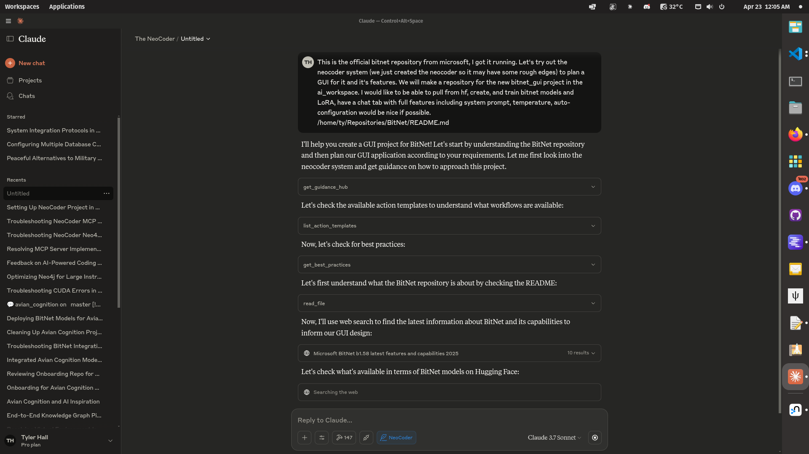

# NeoCoder: Neo4j-Guided AI Coding Workflow

An MCP server implementation that enables AI assistants like Claude to use a Neo4j knowledge graph as their primary, dynamic "instruction manual" and project memory for standardized coding workflows.

## Overview

NeoCoder implements a system where:

1. AI assistants query a Neo4j database for standardized workflows (`ActionTemplates`) triggered by keywords (e.g., `FIX`, `REFACTOR`)
2. The AI follows specific steps in these templates when performing coding tasks
3. Critical steps like testing are enforced before logging success
4. A complete audit trail of changes is maintained in the graph itself

## Quick Start

### Prerequisites

- **Neo4j**: Running locally or a remote instance
- **Python 3.10+**: For running the MCP server
- **uv**: The Python package manager for MCP servers
- **Claude Desktop**: For using with Claude AI



### Installation

1. Install dependencies:

   ```bash
   uv venv
   source venv/bin/activate # On Windows use `venv\Scripts\activate`
   pip install -r requirements.txt
   ```

2. Neo4j connection parameters:
   - **URL**: `bolt://localhost:7687` (default)
   - **Username**: `neo4j` (default)
   - **Password**: Your Neo4j database password
   - **Database**: `neo4j` (default)

   These can be overridden with environment variables:
   - `NEO4J_URL`
   - `NEO4J_USERNAME`
   - `NEO4J_PASSWORD`
   - `NEO4J_DATABASE`

3. Claude Desktop Integration:

   Configure Claude Desktop by adding the following to your `claude-app-config.json`:

   ```json
   {
     "mcpServers": {
       "neocoder": {
         "command": "uv",
         "args": [
           "--directory",
           "/home/ty/Repositories/ai_workspace/NeoCoder-neo4j-ai-workflow/src/mcp_neocoder",
           "run",
           "mcp_neocoder"
         ],
         "env": {
           "NEO4J_URL": "bolt://localhost:7687",
           "NEO4J_USERNAME": "neo4j",
           "NEO4J_PASSWORD": "YOUR_NEO4J_PASSWORD",
           "NEO4J_DATABASE": "neo4j"
         }    
       }    
     }
   }
   ```

   **Important**: The password in this configuration must match your Neo4j database password.

## Suggested system prompt

```plaintext
> **System Instruction:** You are an AI coding assistant integrated with a Neo4j knowledge graph that defines our standard coding procedures and tracks project changes.
>
> **Your Core Interaction Loop:**
> 1.  **Identify Task & Keyword:** Determine the coding action required (e.g., fix a bug -> `FIX`).
> 2.  **Consult the Hub:** If unsure about keywords or process, start by querying `:AiGuidanceHub {id: 'main_hub'}` for guidance and links to best practices or other guides.
> 3.  **Retrieve Instructions:** Formulate a Cypher query to fetch the `steps` from the current `:ActionTemplate` matching the keyword (e.g., `MATCH (t:ActionTemplate {keyword: 'FIX', isCurrent: true}) RETURN t.steps`). Execute this query.
> 4.  **Execute Guided Workflow:** Follow the retrieved `steps` meticulously. This includes reviewing project READMEs, implementing changes, and critically:
> 5.  **Perform Verification:** Execute the testing steps defined in the template. **ALL required tests MUST pass before you consider the task complete.**
> 6.  **Record Completion (Post-Testing):** Only if tests pass, formulate and execute the Cypher query specified in the template to create a `:WorkflowExecution` node, linking it appropriately. Do NOT record if tests failed.
> 7.  **Finalize Updates:** Update the project's README content (in Neo4j or the file) as per the template's instructions.
>
> **Strict Rule:** Always prioritize instructions retrieved from the Neo4j graph over your general knowledge for workflow procedures. Use the graph as your single source of truth for *how* tasks are done here.
```

## Available Templates

NeoCoder comes with three standard templates:

1. **FIX** - Guidance on fixing a reported bug, including mandatory testing and logging
2. **REFACTOR** - Structured approach to refactoring code while maintaining functionality
3. **DEPLOY** - Guidance on deploying code to production environments with safety checks

## Architecture

### Knowledge Graph Structure

- **:AiGuidanceHub**: Central navigation hub for the AI
- **:ActionTemplate**: Templates for standard workflows (FIX, REFACTOR, etc.)
- **:Project**: Project data including README and structure
- **:File/Directory**: Project file structure representation
- **:WorkflowExecution**: Audit trail of completed workflows
- **:BestPracticesGuide**: Coding standards and guidelines
- **:TemplatingGuide**: How to create/modify templates
- **:SystemUsageGuide**: How to use the graph system

### MCP Server Tools

The MCP server provides the following tools to AI assistants:

- **check_connection**: Verify Neo4j connection status
- **get_guidance_hub**: Entry point for AI navigation
- **get_action_template**: Get a specific workflow template
- **list_action_templates**: See all available templates
- **get_best_practices**: View coding standards
- **get_project**: View project details including README
- **list_projects**: List all projects in the system
- **log_workflow_execution**: Record a successful workflow completion
- **get_workflow_history**: View audit trail of work done
- **add_template_feedback**: Provide feedback on templates
- **run_custom_query**: Run direct Cypher queries
- **write_neo4j_cypher**: Execute write operations on the graph

## Customizing Templates

Templates are stored in the `templates` directory as `.cypher` files. You can edit existing templates or create new ones.

To add a new template:

1. Create a new file in the `templates` directory (e.g., `custom_template.cypher`)
2. Follow the format of existing templates
3. Initialize the database to load the template into Neo4j

## License

MIT License
