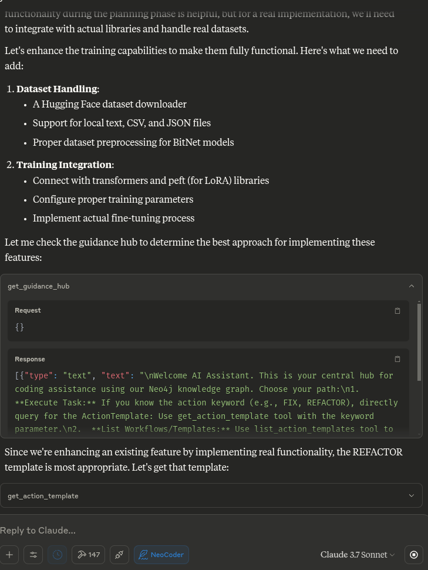
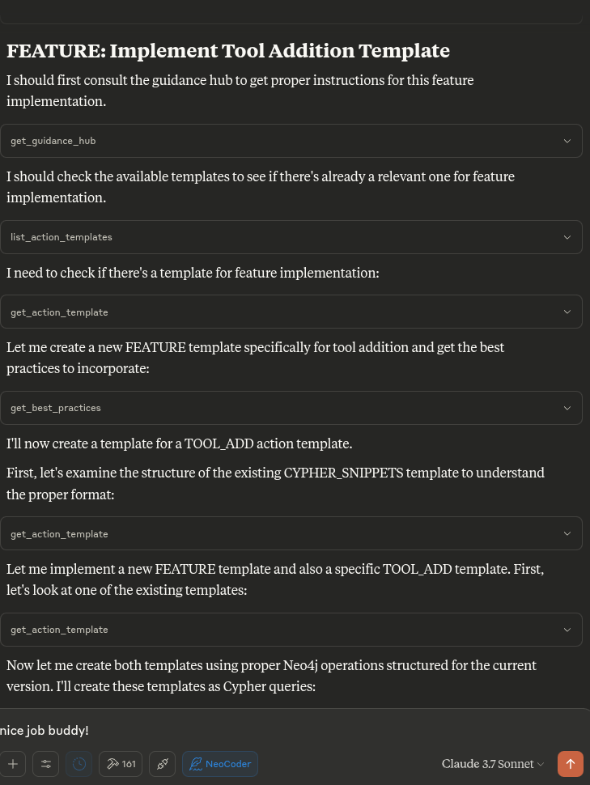

# NeoCoder: Neo4j-Guided AI Coding Workflow

An MCP server implementation that enables AI assistants like Claude to use a Neo4j knowledge graph as their primary, dynamic "instruction manual" and project memory for standardized coding workflows.

## Overview

NeoCoder implements a system where:

1. AI assistants query a Neo4j database for standardized workflows (`ActionTemplates`) triggered by keywords (e.g., `FIX`, `REFACTOR`)
2. The AI follows specific steps in these templates when performing coding tasks
3. Critical steps like testing are enforced before logging success
4. A complete audit trail of changes is maintained in the graph itself

## Quick Start

### Prerequisites

- **Neo4j**: Running locally or a remote instance
- **Python 3.10+**: For running the MCP server
- **uv**: The Python package manager for MCP servers
- **Claude Desktop**: For using with Claude AI
- [MCP-Desktop-Commander](https://github.com/wonderwhy-er/DesktopCommanderMCP):For cli and filesystem operations

## The MCP server runs the Python code, bridging the gap between the Neo4j graph and the AI assistant ( e.g. Claude)




### Installation

1. Install dependencies:

   ```bash
   uv venv
   source .venv/bin/activate
   # On Windows use `venv\Scripts\activate`
   uv pip install -r requirements.txt
   ```

If it doesn't work maybe try:
   ```bash
   pip install -e .
   ```

2. Neo4j connection parameters:
   - **URL**: `bolt://localhost:7687` (default)
   - **Username**: `neo4j` (default)
   - **Password**: Your Neo4j database password
   - **Database**: `neo4j` (default)

   These can be overridden with environment variables:
   - `NEO4J_URL`
   - `NEO4J_USERNAME`
   - `NEO4J_PASSWORD`
   - `NEO4J_DATABASE`

3. Claude Desktop Integration:

   Configure Claude Desktop by adding the following to your `claude-app-config.json`:

   ```json
   {
     "mcpServers": {
       "neocoder": {
         "command": "uv",
         "args": [
           "--directory",
           "/path/to/your/NeoCoder-neo4j-ai-workflow/src/mcp_neocoder",
           "run",
           "mcp_neocoder"
         ],
         "env": {
           "NEO4J_URL": "bolt://localhost:7687",
           "NEO4J_USERNAME": "neo4j",
           "NEO4J_PASSWORD": "<YOUR_NEO4J_PASSWORD>",
           "NEO4J_DATABASE": "neo4j"
         }
       }
     }
   }
   ```

   **Important**: The password in this configuration must match your Neo4j database password.

## Suggested system prompt

```plaintext
> **System Instruction:** You are an AI coding assistant integrated with a Neo4j knowledge graph that defines our standard coding procedures and tracks project changes.
>
> **Your Core Interaction Loop:**
> 1.  **Identify Task & Keyword:** Determine the coding action required (e.g., fix a bug -> `FIX`).
> 2.  **Consult the Hub:** If unsure about keywords or process, start by querying `:AiGuidanceHub {id: 'main_hub'}` for guidance and links to best practices or other guides.
> 3.  **Retrieve Instructions:** Formulate a Cypher query to fetch the `steps` from the current `:ActionTemplate` matching the keyword (e.g., `MATCH (t:ActionTemplate {keyword: 'FIX', isCurrent: true}) RETURN t.steps`). Execute this query.
> 4.  **Execute Guided Workflow:** Follow the retrieved `steps` meticulously. This includes reviewing project READMEs, implementing changes, and critically:
> 5.  **Perform Verification:** Execute the testing steps defined in the template. **ALL required tests MUST pass before you consider the task complete.**
> 6.  **Record Completion (Post-Testing):** Only if tests pass, formulate and execute the Cypher query specified in the template to create a `:WorkflowExecution` node, linking it appropriately. Do NOT record if tests failed.
> 7.  **Finalize Updates:** Update the project's README content (in Neo4j or the file) as per the template's instructions.
>
> **Strict Rule:** Always prioritize instructions retrieved from the Neo4j graph over your general knowledge for workflow procedures. Use the graph as your single source of truth for *how* tasks are done here.
```

## Multiple Incarnations

NeoCoder supports multiple "incarnations" - different operational modes that adapt the system for specialized use cases while preserving the core Neo4j graph structure. In a graph-native stack, the same Neo4j core can manifest as very different "brains" simply by swapping templates and execution policies.

### Key Architectural Principles

The NeoCoder split is highly adaptable because:
- Neo4j stores facts as first-class graph objects
- Workflows live in template nodes
- Execution engines simply walk the graph

Because these three tiers are orthogonal, you can freeze one layer while morphing the others—turning a code-debugger today into a lab notebook or a learning management system tomorrow. This design echoes Neo4j's own "from graph to knowledge-graph" maturation path where schema, semantics, and operations are deliberately decoupled.

### Common Graph Schema Motifs

All incarnations share these core elements:

| Element | Always present | Typical labels / rels |
|---------|----------------|------------------------|
| **Actor** | human / agent / tool | `(:Agent)-[:PLAYS_ROLE]->(:Role)` |
| **Intent** | hypothesis, decision, lesson, scenario | `(:Intent {type})` |
| **Evidence** | doc, metric, observation | `(:Evidence)-[:SUPPORTS]->(:Intent)` |
| **Outcome** | pass/fail, payoff, grade, state vector | `(:Outcome)-[:RESULT_OF]->(:Intent)` |

### Available Incarnations:

- **coding** (default) - Original code workflow management
- **research_orchestration** - Scientific research platform for hypothesis tracking and experiments
  - Register hypotheses, design experiments, capture runs, and publish outcomes
  - Neo4j underpins provenance pilots for lab workflows with lineage queries
- **decision_support** - Decision analysis and evidence tracking system
  - Create decision alternatives with expected-value metrics
  - Bayesian updater agents re-compute metric posteriors when new evidence arrives
  - Transparent, explainable reasoning pipelines
- **continuous_learning** - Adaptive learning environment for education
  - Track learner interaction with problems
  - Estimate mastery and difficulty using Knowledge Space Theory
  - Personalize curriculum based on success rate
- **complex_system** - Complex system modeling and simulation
  - Model components with state vectors and physical couplings
  - Simulate failure propagation using path queries
  - Optional quantum-inspired scheduler for parameter testing
- **knowledge_graph** - Knowledge graph management system
- **data_analysis** - Data analysis and visualization tools

Each incarnation provides its own set of specialized tools that are automatically registered when the server starts. These tools are available for use in Claude or other AI assistants that connect to the MCP server.

### Implementation Roadmap

NeoCoder features an implementation roadmap that includes:

1. **LevelEnv ↔ Neo4j Adapter**: Maps events to graph structures and handles batch operations
2. **Amplitude Register (Quantum Layer)**: Optional quantum-inspired layer for superposition states
3. **Scheduler**: Prioritizes tasks based on entropy and impact scores
4. **Re-using TAG assets**: Leverages existing abstractions for vertical information hiding

### Starting with a Specific Incarnation

```bash
# List all available incarnations
python -m mcp_neocoder.server --list-incarnations

# Start with a specific incarnation
python -m mcp_neocoder.server --incarnation continuous_learning
```

Incarnations can also be switched at runtime using the `switch_incarnation()` tool:

```
switch_incarnation(incarnation_type="complex_system")
```

### Dynamic Incarnation Loading

NeoCoder features a fully dynamic incarnation loading system, which automatically discovers and loads incarnations from the `incarnations` directory. This means:

1. **No hardcoded imports**: New incarnations can be added without modifying server.py
2. **Auto-discovery**: Just add a new file with the format `*_incarnation.py` to the incarnations directory
3. **All tools available**: Tools from all incarnations are registered and available, even if that incarnation isn't active
4. **Easy extension**: Create new incarnations with the provided template

#### Creating a New Incarnation

To create a new incarnation:

1. Create a new file in the `src/mcp_neocoder/incarnations/` directory with the naming pattern `your_incarnation_name_incarnation.py`
2. Use this template structure:

```python
"""
Your incarnation name and description
"""

import json
import logging
import uuid
from typing import Dict, Any, List, Optional, Union

import mcp.types as types
from pydantic import Field
from neo4j import AsyncTransaction

from .polymorphic_adapter import BaseIncarnation, IncarnationType

logger = logging.getLogger("mcp_neocoder.incarnations.your_incarnation_name")


class YourIncarnationNameIncarnation(BaseIncarnation):
    """
    Your detailed incarnation description here
    """

    # Define the incarnation type - must match an entry in IncarnationType enum
    incarnation_type = IncarnationType.YOUR_INCARNATION_TYPE

    # Metadata for display in the UI
    description = "Your incarnation short description"
    version = "0.1.0"

    # Initialize schema and add tools here
    async def initialize_schema(self):
        """Initialize the schema for your incarnation."""
        # Implementation...

    # Add more tool methods below
    async def your_tool_name(self, param1: str, param2: Optional[int] = None) -> List[types.TextContent]:
        """Tool description."""
        # Implementation...
```

3. Add your incarnation type to the `IncarnationType` enum in `polymorphic_adapter.py`
4. Restart the server, and your new incarnation will be automatically discovered

See [incarnations.md](./docs/incarnations.md) for detailed documentation on using and creating incarnations.

## Available Templates

NeoCoder comes with these standard templates:

1. **FIX** - Guidance on fixing a reported bug, including mandatory testing and logging
2. **REFACTOR** - Structured approach to refactoring code while maintaining functionality
3. **DEPLOY** - Guidance on deploying code to production environments with safety checks
4. **FEATURE** - Structured approach to implementing new features with proper testing and documentation
5. **TOOL_ADD** - Process for adding new tool functionality to the NeoCoder MCP server
6. **CYPHER_SNIPPETS** - Manage and use Cypher snippets for Neo4j queries

## Architecture

### Knowledge Graph Structure

- **:AiGuidanceHub**: Central navigation hub for the AI
- **:ActionTemplate**: Templates for standard workflows (FIX, REFACTOR, etc.)
- **:Project**: Project data including README and structure
- **:File/Directory**: Project file structure representation
- **:WorkflowExecution**: Audit trail of completed workflows
- **:BestPracticesGuide**: Coding standards and guidelines
- **:TemplatingGuide**: How to create/modify templates
- **:SystemUsageGuide**: How to use the graph system

### MCP Server Tools

The MCP server provides the following tools to AI assistants:

#### Core Tools
- **check_connection**: Verify Neo4j connection status
- **get_guidance_hub**: Entry point for AI navigation
- **get_action_template**: Get a specific workflow template
- **list_action_templates**: See all available templates
- **get_best_practices**: View coding standards
- **get_project**: View project details including README
- **list_projects**: List all projects in the system
- **log_workflow_execution**: Record a successful workflow completion
- **get_workflow_history**: View audit trail of work done
- **add_template_feedback**: Provide feedback on templates
- **run_custom_query**: Run direct Cypher queries
- **write_neo4j_cypher**: Execute write operations on the graph

#### Incarnation Management Tools
- **get_current_incarnation**: Get the currently active incarnation
- **list_incarnations**: List all available incarnations
- **switch_incarnation**: Switch to a different incarnation
- **suggest_tool**: Get tool suggestions based on task description

Each incarnation provides additional specialized tools that are automatically registered when the incarnation is activated.

#### Cypher Snippet Toolkit

The MCP server includes a toolkit for managing and searching Cypher query snippets:

- **list_cypher_snippets**: List all available Cypher snippets with optional filtering
- **get_cypher_snippet**: Get a specific Cypher snippet by ID
- **search_cypher_snippets**: Search for Cypher snippets by keyword, tag, or pattern
- **create_cypher_snippet**: Add a new Cypher snippet to the database
- **update_cypher_snippet**: Update an existing Cypher snippet
- **delete_cypher_snippet**: Delete a Cypher snippet from the database
- **get_cypher_tags**: Get all tags used for Cypher snippets

This toolkit provides a searchable repository of Cypher query patterns and examples that can be used as a reference and learning tool.

#### Tool Proposal System

The MCP server includes a system for proposing and requesting new tools:

- **propose_tool**: Propose a new tool for the NeoCoder system
- **request_tool**: Request a new tool feature as a user
- **get_tool_proposal**: Get details of a specific tool proposal
- **get_tool_request**: Get details of a specific tool request
- **list_tool_proposals**: List all tool proposals with optional filtering
- **list_tool_requests**: List all tool requests with optional filtering

This system allows AI assistants to suggest new tools and users to request new functionality, providing a structured way to manage and track feature requests.



## Customizing Templates

Templates are stored in the `templates` directory as `.cypher` files. You can edit existing templates or create new ones.

To add a new template:

1. Create a new file in the `templates` directory (e.g., `custom_template.cypher`)
2. Follow the format of existing templates
3. Initialize the database to load the template into Neo4j

## The 'Cypher Snippet Toolkit' tools operate on the graph structure defined below

Below is a consolidated, **Neo4j 5-series–ready** toolkit you can paste straight into Neo4j Browser, Cypher shell, or any driver.
It creates a *mini-documentation graph* where every **`(:CypherSnippet)`** node stores a piece of Cypher syntax, an example, and metadata; text and (optionally) vector indexes make the snippets instantly searchable from plain keywords *or* embeddings.

---

## 1 · Schema & safety constraints

```cypher
// 1-A Uniqueness for internal IDs
CREATE CONSTRAINT cypher_snippet_id IF NOT EXISTS
FOR   (c:CypherSnippet)
REQUIRE c.id IS UNIQUE;            // Neo4j 5 syntax

// 1-B Optional tag helper (one Tag node per word/phrase)
CREATE CONSTRAINT tag_name_unique IF NOT EXISTS
FOR   (t:Tag)
REQUIRE t.name IS UNIQUE;
```

## 2 · Indexes that power search

```cypher
// 2-A Quick label/property look-ups
CREATE LOOKUP INDEX snippetLabelLookup IF NOT EXISTS
FOR (n) ON EACH labels(n);

// 2-B Plain-text index (fast prefix / CONTAINS / = queries)
CREATE TEXT INDEX snippet_text_syntax IF NOT EXISTS
FOR (c:CypherSnippet) ON (c.syntax);

CREATE TEXT INDEX snippet_text_description IF NOT EXISTS
FOR (c:CypherSnippet) ON (c.description);

// 2-C Full-text scoring index (tokenised, ranked search)
CREATE FULLTEXT INDEX snippet_fulltext IF NOT EXISTS
FOR (c:CypherSnippet) ON EACH [c.syntax, c.example];

// 2-D (OPTIONAL) Vector index for embeddings ≥Neo4j 5.15
CREATE VECTOR INDEX snippet_vec IF NOT EXISTS
FOR (c:CypherSnippet) ON (c.embedding)
OPTIONS {indexConfig: {
  `vector.dimensions`: 384,
  `vector.similarity_function`: 'cosine'
}};
```

*If your build is ≤5.14, call `db.index.vector.createNodeIndex` instead.*

## 3 · Template to store a snippet

```cypher
:params {
  snippet: {
    id:         'create-node-basic',
    name:       'CREATE node (basic)',
    syntax:     'CREATE (n:Label {prop: $value})',
    description:'Creates a single node with one label and properties.',
    example:    'CREATE (p:Person {name:$name, age:$age})',
    since:      5.0,
    tags:       ['create','insert','node']
  }
}

// 3-A MERGE guarantees idempotence
MERGE (c:CypherSnippet {id:$snippet.id})
SET   c += $snippet
WITH  c, $snippet.tags AS tags
UNWIND tags AS tag
  MERGE (t:Tag {name:tag})
  MERGE (c)-[:TAGGED_AS]->(t);
```

Parameter maps keep code reusable and prevent query-plan recompilation.

## 4 · How to search

### 4-A Exact / prefix match via TEXT index

```cypher
MATCH (c:CypherSnippet)
WHERE c.name STARTS WITH $term      // fast TEXT index hit
RETURN c.name, c.syntax, c.example
ORDER BY c.name;
```

### 4-B Ranked full-text search

```cypher
CALL db.index.fulltext.queryNodes(
  'snippet_fulltext',               // index name
  $q                                // raw search string
) YIELD node, score
RETURN node.name, node.syntax, score
ORDER BY score DESC
LIMIT 10;
```

### 4-C Embedding similarity (vector search)

```cypher
WITH $queryEmbedding AS vec
CALL db.index.vector.queryNodes(
  'snippet_vec', 5, vec            // top-5 cosine hits
) YIELD node, similarity
RETURN node.name, node.syntax, similarity
ORDER BY similarity DESC;
```

## 5 · Updating or deleting snippets

```cypher
// 5-A Edit description
MATCH (c:CypherSnippet {id:$id})
SET   c.description = $newText,
      c.lastUpdated = date()
RETURN c;

// 5-B Remove a snippet cleanly
MATCH (c:CypherSnippet {id:$id})
DETACH DELETE c;
```

Both operations automatically maintain index consistency – no extra work required.

## 6 · Bulk export / import (APOC)

```cypher
CALL apoc.export.cypher.all(
  'cypher_snippets.cypher',
  {useOptimizations:true, format:'cypher-shell'}
);
```

This writes share-ready Cypher that can be replayed with `cypher-shell < cypher_snippets.cypher`.

---

### Quick-start recap

1. **Run Section 1 & 2** once per database to set up constraints and indexes.
2. Use **Section 3** (param-driven) to add new documentation entries.
3. Query with **Section 4**, and optionally add vector search if you store embeddings.
4. Backup or publish with **Section 6**.

With these building blocks you now have a *living*, searchable "Cypher cheat-sheet inside Cypher" that always stays local, versionable, and extensible. Enjoy friction-free recall as your query repertoire grows!

*Note: A full reference version of this documentation that preserves all original formatting is available in the `/docs/cypher_snippets_reference.md` file.*

Created by [angrysky56](https://github.com/angrysky56)
Claude 3.7 Sonnet
Gemini 2.5 Pro Preview 3-25
ChatGPT o3

## Recent Updates

### 2025-04-25: Expanded Incarnation Documentation (v1.2.0)
- Added detailed documentation on the architectural principles behind multiple incarnations
- Enhanced description of each incarnation type with operational patterns and use cases
- Added information about common graph schema motifs across incarnations
- Included implementation roadmap for integrating quantum-inspired approaches

### 2025-04-24: Fixed Incarnation Tool Registration (v1.1.0)
- Fixed the issue where incarnation tools weren't being properly registered on server startup
- Fixed circular dependency issues with duplicate class definitions
- Added explicit tool method declaration support via `_tool_methods` class attribute
- Improved the tool discovery mechanism to ensure all tools from each incarnation are properly detected
- Enhanced event loop handling to prevent issues during server initialization
- Added comprehensive logging to aid in troubleshooting
- Fixed schema initialization to properly defer until needed

See the [CHANGELOG.md](./CHANGELOG.md) file for detailed implementation notes.

## License

MIT License
